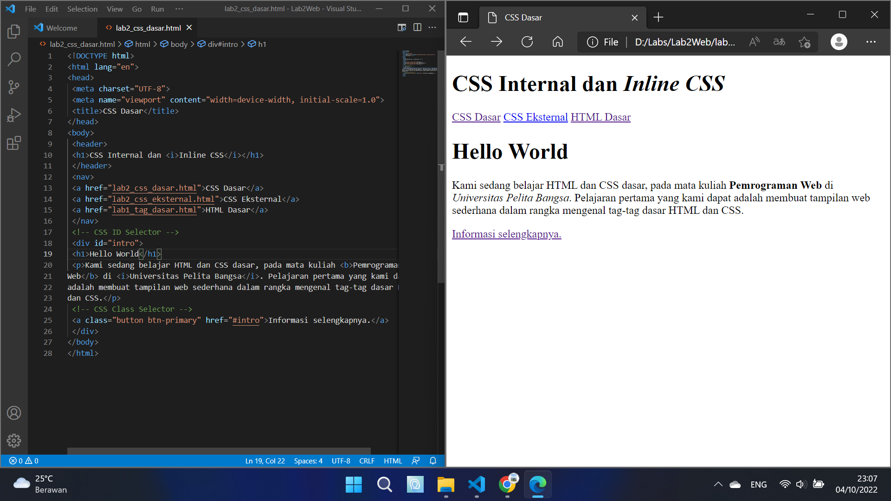
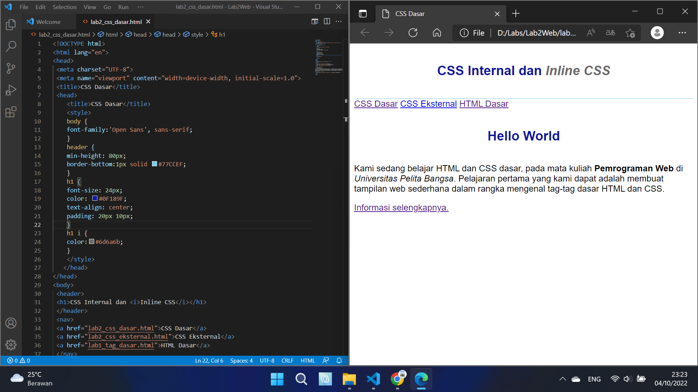
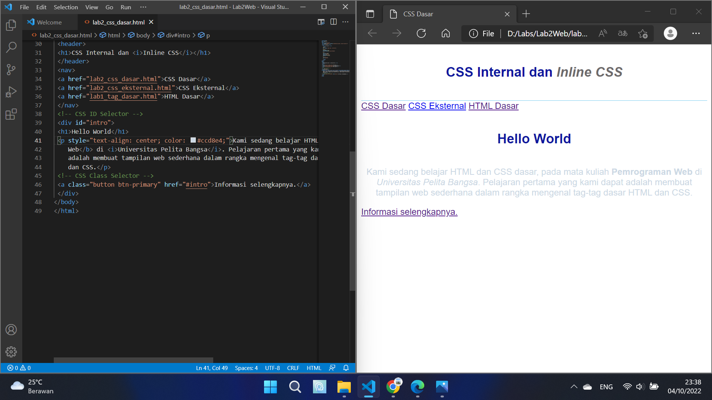
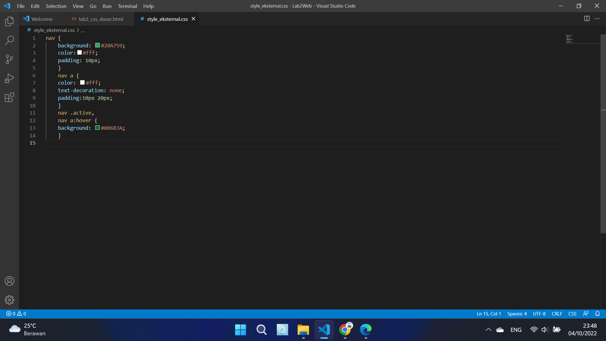
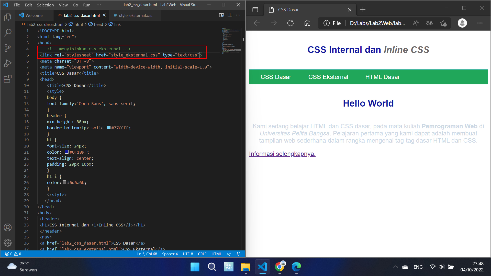
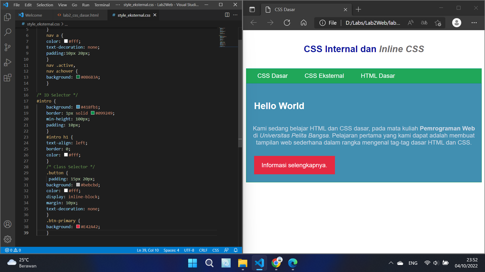
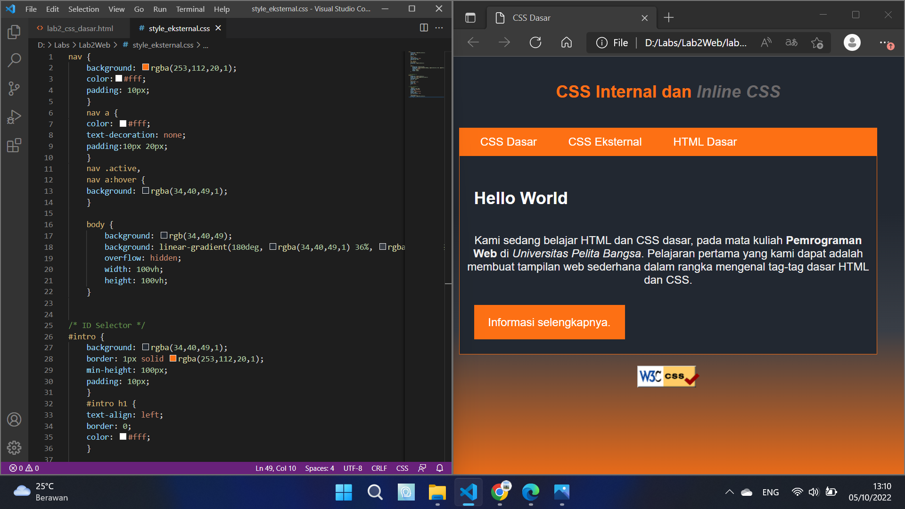

# Lab2Web
## Ananda Fachri Reynaldi
## 312110248
## TI.21.B1

1. Membuat dokumen HTML baru di VS Code

2. Menambahkan deklarasi CSS Internal pada bagian head dokumen

3. Menambahkan deklarasi Inline CSS pada tag `<p>`
```
<p style="text-align: center; color: #ccd8e4;">
```

4. Membuat file baru dengan nama style_eksternal.css berisikan :
```
nav {
background: #20A759;
color:#fff;
padding: 10px;
}
nav a {
color: #fff;
text-decoration: none;
padding:10px 20px;
}
nav .active,
nav a:hover {
background: #0B6B3A;
}
```

Lalu tambahkan tag `<link>` untuk merujuk file css yang sudah dibuat pada bagian `<head>`
```
<head>
 <!-- menyisipkan css eksternal -->
 <link rel="stylesheet" href="style_eksternal.css" type="text/css">
</head>
```

5. Menambahkan CSS Selector
Pada file style_eksternal.css, tambahkan kode berikut :
```
/* ID Selector */
#intro {
background: #418fb1;
border: 1px solid #099249;
min-height: 100px;
padding: 10px;
}
#intro h1 {
text-align: left;
border: 0;
color: #fff;
}
/* Class Selector */
.button {
 padding: 15px 20px;
background: #bebcbd;
color: #fff;
display: inline-block;
margin: 10px;
text-decoration: none;
}
.btn-primary {
background: #E42A42;
}
```


## Jawab Pertanyaan Berikut
1. Lakukan eksperimen dengan mengubah dan menambah properti dan nilai pada 
kode CSS dengan mengacu pada CSS Cheat Sheet yang diberikan pada file terpisah dari modul ini.
Berikut ini hasil eksperimennya

